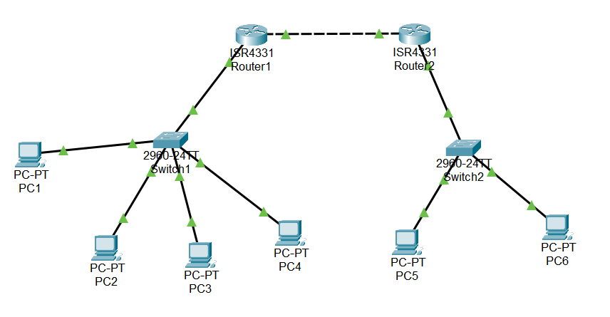

# Enterprise Network Troubleshooting Lab

## Overview

This project is a Cisco Packet Tracer network troubleshooting lab that simulates a small multi-site enterprise network with VLAN segmentation, inter-VLAN routing, DHCP, OSPF routing, ACL-based traffic control, SSH management, and branch connectivity.

The project focuses on identifying and resolving real-world network faults. Seven troubleshooting tickets were created, tested, diagnosed, fixed, and verified using Cisco IOS commands.

---

## Project Objectives

- Build a small enterprise-style network in Cisco Packet Tracer
- Configure VLANs, trunks, DHCP, OSPF, ACLs, and SSH
- Create realistic network faults
- Troubleshoot each issue using verification commands
- Document symptoms, root causes, fixes, and final results
- Present the project as a network engineering portfolio piece

---

## Network Topology

The network contains:

- 2 routers: R1 and R2
- 2 switches: S1 and S2
- 6 end devices across HQ and branch networks
- HQ VLANs for HR, IT, Guest, and Management
- Branch VLANs for HR, IT, and Guest
- Router-on-a-stick inter-VLAN routing
- OSPF routing between R1 and R2
- DHCP services provided by routers
- SSH access restricted through management ACLs

Topology screenshot:



---

## VLAN and IP Addressing Plan

| VLAN | Name | HQ Subnet | Branch Subnet | Purpose |
|---|---|---|---|---|
| 10 | HR | 192.168.10.0/24 | 192.168.110.0/24 | HR users |
| 20 | IT | 192.168.20.0/24 | 192.168.120.0/24 | IT users |
| 30 | Guest | 192.168.30.0/24 | 192.168.130.0/24 | Guest users |
| 99 | Management | 192.168.99.0/24 | N/A | Device management |
| N/A | Router Link | 10.0.0.0/30 | 10.0.0.0/30 | R1 to R2 OSPF link |

---

## Technologies Used

- Cisco Packet Tracer
- VLANs
- 802.1Q trunking
- Router-on-a-stick
- Inter-VLAN routing
- DHCP
- OSPF single-area routing
- Access Control Lists
- SSH remote management
- Basic network troubleshooting commands

---

## Baseline Features

Before faults were introduced, the network was configured and tested with the following working features:

- PCs received DHCP addresses from the correct VLAN pools
- VLAN 10, VLAN 20, VLAN 30, and VLAN 99 were configured on S1
- VLAN 10, VLAN 20, and VLAN 30 were configured on S2
- Router subinterfaces were configured for inter-VLAN routing
- Trunk links carried the correct VLANs
- R1 and R2 exchanged routes using OSPF
- HR to IT traffic restriction was enforced using ACL 100
- SSH access to R1 was limited to the management VLAN

---

## Troubleshooting Tickets

### Ticket 1: DHCP Failure

**Problem:** PC1 in VLAN 10 could not receive an IP address from DHCP.

**Symptoms:**
- PC1 failed to obtain a 192.168.10.x address.
- DHCP leases existed for other VLANs, but not VLAN 10.

**Commands Used:**
```bash
show ip dhcp binding
show ip dhcp pool
show running-config | section dhcp
ping 192.168.10.1
```

**Root Cause:**  
The DHCP exclusion range was incorrectly configured, causing VLAN 10 DHCP allocation to fail. After removing the incorrect exclusion, the VLAN 10 DHCP pool had to be recreated.

**Fix Applied:**
```bash
no ip dhcp pool VLAN10
ip dhcp pool VLAN10
 network 192.168.10.0 255.255.255.0
 default-router 192.168.10.1
 dns-server 8.8.8.8
```

**Verification:**  
PC1 successfully received a valid 192.168.10.x address.

---

### Ticket 2: Wrong VLAN Assignment

**Problem:** PC2 received an IP address from the wrong VLAN.

**Symptoms:**
- PC2 was expected to be in VLAN 20.
- PC2 received a VLAN 30 address instead.

**Commands Used:**
```bash
show vlan brief
show interfaces fa0/3 switchport
```

**Root Cause:**  
The switch access port connected to PC2 was assigned to VLAN 30 instead of VLAN 20.

**Fix Applied:**
```bash
interface fa0/3
 switchport mode access
 switchport access vlan 20
```

**Verification:**  
PC2 successfully received a 192.168.20.x address.

---

### Ticket 3: Trunk Allowed VLAN Issue

**Problem:** PC3 in Guest VLAN 30 could not reach its default gateway.

**Symptoms:**
- PC3 had a VLAN 30 IP address.
- Ping to 192.168.30.1 failed.

**Commands Used:**
```bash
show interfaces trunk
show vlan brief
```

**Root Cause:**  
VLAN 30 was missing from the trunk allowed VLAN list on S1.

**Fix Applied:**
```bash
interface fa0/1
 switchport trunk allowed vlan 10,20,30,99
```

**Verification:**  
PC3 successfully pinged 192.168.30.1.

---

### Ticket 4: OSPF Routing Failure

**Problem:** HQ and branch networks could not communicate.

**Symptoms:**
- PC1 could not reach the branch gateway.
- OSPF routes were missing.
- OSPF neighbour relationship failed or became unstable.

**Commands Used:**
```bash
show ip ospf neighbor
show ip route
show ip protocols
```

**Root Cause:**  
The R2 point-to-point link was placed in the wrong OSPF area.

**Fix Applied:**
```bash
router ospf 1
 no network 10.0.0.0 0.0.0.3 area 1
 network 10.0.0.0 0.0.0.3 area 0
```

**Verification:**  
R1 and R2 formed an OSPF neighbour relationship and remote routes appeared in the routing table.

---

### Ticket 5: ACL Misconfiguration

**Problem:** HR traffic was blocked from the wrong destination network.

**Symptoms:**
- HR VLAN 10 was blocked from Guest VLAN 30.
- HR VLAN 10 was able to reach IT VLAN 20, which should have been restricted.

**Commands Used:**
```bash
show access-lists
show running-config | section access-list
show running-config interface g0/0/0.10
```

**Root Cause:**  
ACL 100 had the wrong destination network. It blocked HR to Guest instead of HR to IT.

**Fix Applied:**
```bash
no access-list 100
access-list 100 deny ip 192.168.10.0 0.0.0.255 192.168.20.0 0.0.0.255
access-list 100 permit ip any any
```

**Verification:**  
HR to IT traffic was blocked, while HR to Guest traffic was allowed.

---

### Ticket 6: SSH Management Access Failure

**Problem:** PC4 in the management VLAN could not SSH into R1.

**Symptoms:**
- PC4 had the correct management VLAN IP address.
- SSH connection to R1 failed.

**Commands Used:**
```bash
show access-lists
show running-config | section line vty
show running-config | include access-list 10
```

**Root Cause:**  
The VTY access-class ACL allowed the wrong subnet. It allowed 192.168.98.0/24 instead of the management subnet 192.168.99.0/24.

**Fix Applied:**
```bash
no access-list 10
access-list 10 permit 192.168.99.0 0.0.0.255
```

**Verification:**  
PC4 successfully accessed R1 using SSH.

---

### Ticket 7: Branch Connectivity Issue

**Problem:** PC5 in the branch HR VLAN could not reach its gateway or HQ networks.

**Symptoms:**
- PC5 was correctly connected to S2.
- PC5 could not ping 192.168.110.1.
- Branch connectivity to HQ failed.

**Commands Used:**
```bash
show vlan brief
show interfaces trunk
show running-config interface g0/0/0.10
show ip interface brief
```

**Root Cause:**  
R2’s VLAN 10 subinterface was configured with the wrong 802.1Q tag. PC5 was in VLAN 10, but R2 was expecting VLAN 11 traffic.

**Fix Applied:**
```bash
interface g0/0/0.10
 encapsulation dot1Q 10
```

**Verification:**  
PC5 successfully pinged its gateway and HQ networks.

---

## Final Verification

After all faults were resolved:

- DHCP worked for all user VLANs
- PCs received correct IP addresses
- Trunk ports carried the correct VLANs
- Inter-VLAN routing worked
- OSPF routes were exchanged between R1 and R2
- ACL rules blocked only the intended traffic
- SSH access worked from the management VLAN
- Branch and HQ connectivity was restored

---

## Project Outcome

This project demonstrates the ability to configure, break, diagnose, and repair a small enterprise network. It reflects practical troubleshooting skills required for network support, junior network engineer, and IT infrastructure roles.
